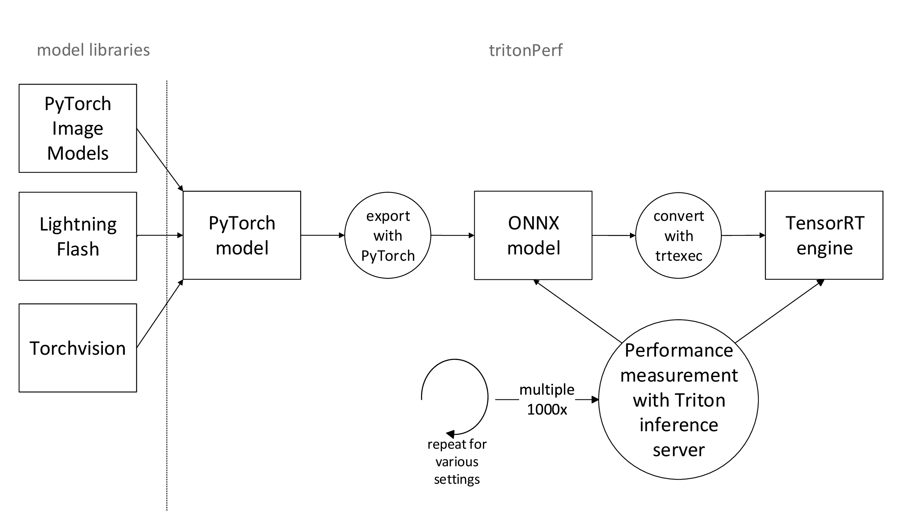
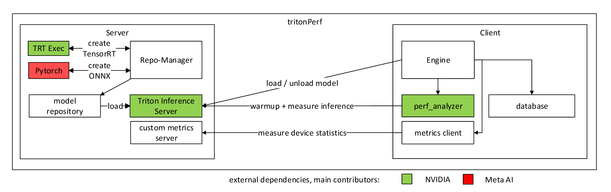
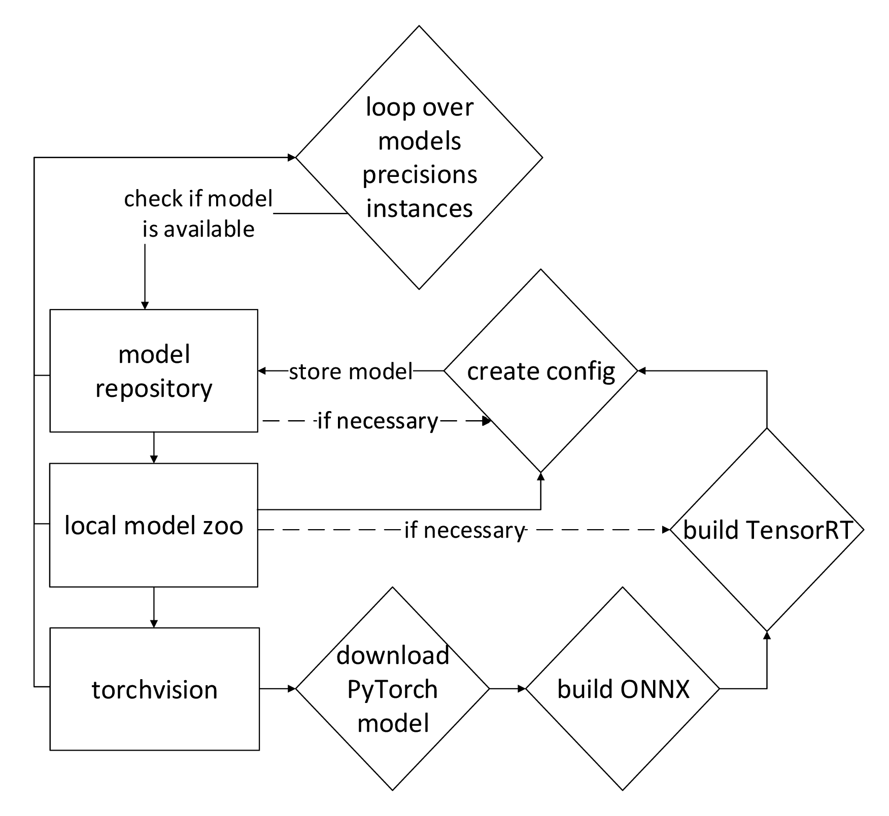

# Overview
This code provides the implementation of tritonPerf, a benchmarking tool that automates the evaluation of runtime performance (latency and throughput) for various deep neural network (DNN) models in different configurations on specific hardware. It enables developers of real-world applications for DNNs to make informed decisions about model selection before investing time and resources in model development and hyperparameter tuning.

The corresponding paper was published as Völter, Constantin, Timo Koppe, and Phillip Rieger. "Don't Buy the Pig in a Poke: Benchmarking DNNs Inference Performance before Development." Hawaii International Conference on System Sciences (HICSS) 2024. [Paper available here.](https://scholarspace.manoa.hawaii.edu/items/eb82675a-7625-4674-baab-91ce311c26c1)

```bibtex
@inproceedings{volter2024don,
  title={Don't Buy the Pig in a Poke: Benchmarking DNNs Inference Performance before Development},
  author={V{\"o}lter, Constantin and Koppe, Timo and Rieger, Phillip},
  booktitle={Hawaii International Conference on System Sciences (HICSS)},
  year={2024}
}
```

This code is provided as an experimental implementation for testing purposes and should not be used in a productive environment. We cannot guarantee security, safety, or correctness.


# Introduction 
Since AI experts only do minor changes to existing, well-known AI models, it is helpful to know their
performance constraints. tritonPerf provides the developer with the expected runtime performance of
57 state-of-the-art AI models. The results allow the developer to estimate the expected performance
of their individual solution.



The figure above shows the general scheme of tritonPerf. Beginning with the model libraries, tritonPerf
downloads the selected PyTorch models. In order to
perform measurements with the models, it converts them to ONNX-models. describes
how an AI model can be optimized by using TensorRT. tritonPerf uses the command line interface of
TensorRT to generate hardware-specific TensorRT engines. Both ONNX and TensorRT models can be
measured in various settings. For a broad overview, multiple thousand measurements are needed.
tritonPerf is able to automatically perform such an amount of measurements.


## Iterations
tritonPerf offers the benefit of combining multiple settings to get a rich overview of inference
performance. tritonPerf covers all these configurations:
* models
* network protocol: gRPC vs HTTP
* number of instances
* number of concurrent requests
* input size
* batchsize
* client only/server only for network measurement
* CPU/GPU inference
* precision: FP32 vs FP16 or INT8

```
ForEach m in models:
    If gRPC on
        use gRPC and HTTP
    Else
        use HTTP only
    ForEach p in precisions:
        ForEach i in instances:
            ForEach c in concurrencies:
                If c > i:
                    continue
                ForEach s in shapes:
                    ForEach b in batch sizes:
                        model-warmup
                        Do
                            VRAM, RAM, GPU statistics
                        doWhile
                            measure throughput, latency
```



## Components


**client and server**
As mentioned above, tritonPerf is split in two pieces which communicate through the network with
each other. The user can select if both client and server are started on the same machine or if only
one part should be used.

The server part creates the AI models such that these can be used by the inference server. After
creating the AI models, it starts the Triton inference server. Additionally, it provides a metrics service
which reports hardware statistics. In contrast, the client part creates the inference requests for
the server. It uses the perf_analyzer tool which is part of the Triton Inference Server. While the
perf_analyzer measures the latency and throughput in a very detailed manner, an additional metrics
client connects to the metrics server. All results are written into a database for further analysis.



**repository-manager**
The Figure above shows the architecture of the repository-manager, which is responsible for building the
ONNX- and TensorRT-files and places them in the working directory of the Triton-Server, the model
repository. If the ONNX-file of a selected model is not already available in the model-repository,
it loads it from the local model-zoo and builds an optimized TensorRT-file. tritonPerf can also
download PyTorch models from the torchvision-library and create its own ONNX-files. All models
are compiled with a variable image-size, which allows shapes between 256x256 and 1024x1024
and batchsizes between 1 and 16. This variable input shape gives tritonPerf the ability to perform
multiple measurements with one model, differentiating it from other benchmarking tools.
Although Triton can automatically detect suitable settings to run an ONNX or TensorRT-engine, the
standard configuration does not allow batching or CPU-only execution. Therefore, tritonPerf creates
a configuration-file for each model for the Triton Inference server. This file specifies the correct
number of instances, the maximum batch size, the correct precision and the CPU/GPU-device.

**engine**
The engine orchestrates the interaction between the Triton-Inference Server and the perf_analyzer
tool. This includes loading and unloading the model-files and performing the inference-measurements
35with the correct settings. A new model is loaded for each combination of model, precision and instance
number. The loading is performed with a HTTP-POST-request, this allows to run the measurement-
client and inference server on different computers.

**metrics service**
Triton includes a metrics service that shows GPU utilization, server throughput, etc. However, it
does not support statistics from the Jetson AGX-Xavier’s Volta GPU. Therefore, tritonPerf includes
a metrics-service, which reports various parameters including the usage of GPU, CPU and main-
memory. This service can easily be adapted to different hardware platforms.
Finally, tritonPerf is the main entry point to start the program, it invokes the repository-manager,
starts the Triton inference server, performs the measurements with the help of the engine and saves
all results in a database. Algorithm 1 shows how tritonPerf loops over multiple settings and hands
them over to the engine.

## Measurements
Early tests showed the first few inferences are significantly slower than the subsequent ones. Especially
TensorRT-engines need initial warmup-requests to activate all GPU-features. Although Triton server
includes such a warmup-feature, it does not suit to this measurement scenario. Unfortunately, the
warm-up it is statically defined for each model. More precisely, only one setting per model can be
used for warmup. In contrast this measurement use case performs multiple settings on each model.
To take account for it, tritonPerf performs at least 30 requests with the identical settings used in the
measurement, e.g. the correct batchsize, shape and concurrency.
All measurements are performed in synchronous mode, which ensures that requests are processed
sequentially.
Although there is an option for the inference client and server to share input and output data in the
same memory, tritonPerf transfers them through the network to create a more practical scenario.
To ensure comparability, all input data is chosen at random. Despite slight differences between the
input data, this practice shows stable results. A measurement is executed for a fixed time interval and
repeated three times. The evaluation is only used if the average latency of each measurement interval
differs less than 10 percent from the other two. The performance result is the average latency and
36throughput of the performed requests. Additionally, it captures the standard deviation and the 50,
90, 95 and 99th percentiles.


# Getting Started

Supported OS: Jetpack 4.6,5.0, ubuntu x64

## Dependencies:
- Docker
- Jetson stats: https://github.com/rbonghi/jetson_stats 
```sudo -H pip install -U jetson-stats```

## Installation:
```docker build -t tritonperf:latest -f dockerfile_tritonperf_jetpack_4_6 .```

## Start docker container:
- bind Jtop for Metrics service (only for jetpack)
- bind tritonPerf-git folder
- (optional) bind ports for network measurements:
``` -p 8000:8000 -p 8001:8001 -p 8002:8002 -p 8003:8003 -p 8004:8004 ```
- main command:
```docker run --gpus=all -it -v /run/jtop.sock:/run/jtop.sock -v /home/xavier/tritonPerformance/:/tritonperf tritonperf:latest```

## Run tritonPerf:
- Place your models in ```/tritonPerf/zoo```
* model structure for ONNX:
```
/tritonPerf/zoo/
    <model-name>/
      config.pbtxt
      1/
        model.onnx
```
content of config.pbtxt:

```
name: "densenet121"
platform: "onnxruntime_onnx"
max_batch_size: 16
input [
	{
		name: "input"
		data_type: TYPE_FP32
		dims: [3, -1, -1] #or fixed input shapes: dims: [3, 1024, 1024]
	}
]
```
Only the input and batch size need to be specified, the input shape can be fixed or variable

* model structure for TensorRT:
```
/tritonPerf/zoo/
    <model-name_trt_fp16>/ # or <model-name_trt_fp32>/
      config.pbtxt
      1/
        model.plan
```
content of config.pbtxt:

```
name: "densenet121_trt_fp16"
platform: "tensorrt_plan"
max_batch_size: 16
input [
	{
		name: "input"
		data_type: TYPE_FP32
		dims: [3, -1, -1]
	}
]
```

- Change the config-file according to your settings (see further down):
    ```.\utils\default_config.ini```

- Change to working dir:
```cd /tritonperf```

- Run tritonPerf:
```python3 tritonPerformance.py ```

## Collect the results:
 - results are placed in the folder:
 ```\tritonperf\results\YYYY_MM_DD_HH_MM```
 - the results include:
* the config file: these are the settings for the measurements
* results are provided in the three formats: sqlite, csv, avro
* a logfile
* measurement.csv can be ignored


# Details:

## Measurement-config:
Format:
This is the default config with all configuration options, they are filled out with default values


```
[setting]
    key = value
```
 key is irrelevant but should only be unique in one setting
```
[measurement_interval]
    1 = 5
```
 Duration of the measurement, default: 20 seconds.
    Decrease for faster measurements, increase if larger models need longer for stable measurements

```
[warmup]: 
    1 = on
```
Default on, stabilizes measurements, see intro


```
[server_only]
     1 = off
```
Initializes the model-repo, starts triton_server, as well as metrics server and waits for requests

```[host] 
    1 = 192.168.2.210
    1 = localhost
```
connect to the triton inference server at this IP

```
[client_only]
    1 = off
```
Initializes the model-repo, starts triton_server, and waits for requests
```
[gpu_metrics]: 
    1 = on
```
Specifies if the metrics server and client should be used

```
[cpu] 
    1 = off
```
measure with CPU execution additionally to GPU

```
[model_dir]
    1 = ./models/
```
Model directory for triton inference server

```
[zoo_dir]
    1 = ./zoo/
```

Input folder for new models, tritonPerf copies models from the zoo and places them in the model-dir
```
[models]
    1 = densenet121
```
Model names, without "_trt32" extension

```
[grpc] 
    1 = off
```
measure with gRPC additionally to REST

```
[precisions]
    1 = fp16
    2 = int8
```
Precisions for measurements, only relevant for TensorRT, fp32 is always on

```
[instances]
    1 = 1
```
Number of instances of a model

```
[concurrencies]
    1 = 1
```
Specifies how many concurrent requests should be used. Tritonperf does not measure a higher concurrency than instance. Iterates over all values

```
[shapes]
    1 = 3,256,256
    2 = 3,384,384
    3 = 3,512,512
    4 = 3,768,768
    5 = 3,1024,1024
```
measure these input shapes

```
[batchsizes]
    1 = 2
    2 = 4
```
Specifies the batch size, iterates over all values

```
[trt]
    1 = on
```
Use TensorRT, if models with extension *_trt_fp32* are not in the zoo, tritonPerf generates it

```
[trt_shapes]: 
    min = 1,3,256,256
    opt = 16,3,320,320
    max = 32,3,448,448
```
(Experimental) If models in zoo are not with extension *_trt_fp32*, tritonPerf generates the TensorRT models with these settings

```
[trt_workspace_size]
    1 = 28000
```

 (Experimental) If models in zoo are not with extension *_trt_fp32*, tritonPerf generates the TensorRT-plans with this workspace-size in MB

```
[findmaxbatchsize]
    1 = off

```
stop increasing the batchsize if throughput decreases

```
[triton_server_dir]
    1 = /triton_server/bin/tritonserver
```
select where the binary of triton_server is located


## results database:

* **execution count**: a counter for each measurement, starts with 0
* **model_name**: name of the model
* **measurement_interval**: length of the measurement  
* **model_name**: name of the model
* **model_nr**: number of the model, increased per model, per instance and for tensorrt
* **grpc_on**: specifies if grpc on, false or true
* **tensorRT**: specifies if tensorRT on, false or true
* **onnx_cpu**: specifies if onnx on, false or true
* **onnx_gpu**: specifies if gpu on, false or true
* **fp32**: specifies if fp32 presision on, false or true
* **fp16**:  specifies if fp16 precision on, false or true
* **int8**: specifies if int8 precision on, false or true
* **instances**: number of model instances on the server for a measurement
* **batchsize**: number of batch size for a measurement
* **shape**: current input shape of the measurement
* **concurrency**: concurrent requests send from the client to the server for each measurement
* **gpu_ram_before_model_load**: GPU ram before the model load, in MB (unprecise, gives the allocated GPU RAM which can be higher than actually needed), measurement collected with Jetson-stats, refer to this manual
* **total_ram_before_model_load**: Total RAM usage before the model load in MB, shows reliable results, refer to Jetson-stats manual 
* **all_stats_before_model_load**: Raw data from Jetson-stats before, constains information for further analysis, refer to Jetson-stats manual 
* **gpu_ram_before_measure**: GPU ram before measurement, in MB (unprecise, gives the allocated GPU RAM which can be higher than actually needed), measurement collected with Jetson-stats, refer to this manual
* **total_ram_before_measure**: Total RAM usage before measurement in MB, shows reliable results, refer to Jetson-stats manual 
* **all_stats_before_measure**: Raw data from Jetson-stats before measurement, constains information for further analysis, refer to Jetson-stats manual 
* **gpu_ram_during**: GPU ram during measurement, in MB (relatively precise, gives the allocated GPU RAM which can be higher than actually needed), measurement collected with Jetson-stats, refer to this manual
* **total_ram_during**:
* **standard_dev**: standard deviation from the mean of the measurement in ns. This is the output from triton perf_analyzer, refer to this manual for more info
* **trt_workspace_size**: (Experimental) workspace size for the compilation of the tensorRT plan
* **triton_ip**: IP-address of the triton inference server
* **triton_http_port**: HTTP-port of the triton inference server
* **warmup**: Specifies if warmup is on, default is on
* **Inferences_Second**: mean of Inferences per second, this is the output of triton perf_analyzer, refer to this manual for more info
* **ClientSend**: mean of the client send latency. This is the output of triton perf_analyzer, refer to this manual for more info
* **NetworkandServerSend_Recv**: mean of the network server and server send receive latency. This is the output of triton perf_analyzer, refer to this manual for more info
* **ServerQueue**: mean of the server queue latency. This is the output of triton perf_analyzer, refer to this manual for more info
* **ServerComputeInput**: mean of the server compute input latency. This is the output of triton perf_analyzer, refer to this manual for more info
* **ServerComputeInfer**: mean of the server compute inference latency. This is the output of triton perf_analyzer, refer to this manual for more info
* **ServerComputeOutput**: mean of the server compute output latency. This is the output of triton perf_analyzer, refer to this manual for more info
* **ClientRecv**: mean of the client receive latency. This is the output of triton perf_analyzer, refer to this manual for more info
* **p50latency**: median of the latency. This is the output of triton perf_analyzer, refer to this manual for more info
* **p90latency**: 90th percentile of the latency. This is the output of triton perf_analyzer, refer to this manual for more info
* **p95latency**: 95th percentile of the latency. This is the output of triton perf_analyzer, refer to this manual for more info
* **p99latency**: 99th percentile of the latency. This is the output of triton perf_analyzer, refer to this manual for more info


## Known bugs:
- too many instances can exceed the RAM-capacity, tritonPerf, triton server and docker crash, nevetheless, the docker container can be restarted
- too short measurements can lead to insufficient measurements. Fix: Increas measurement_interval (can be recognized by standard_dev = 0 in the results file)
